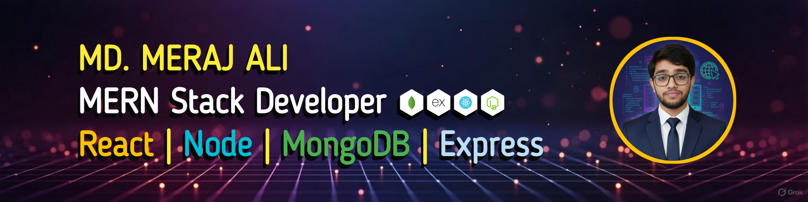

<!-- ===================== BANNER ===================== -->
<div>
 <p align="center">
 
</p>
</div>


<div>
 <h1 style="display: inline-block">Hi 👋, I'm Md. Meraj Ali</h1>
</br>
 <p align="center">
 
</p>
</div>


---

## 👨‍💻 About Me

Hi! I’m **MD. Meraj Ali**, a passionate **MERN Stack Developer** experienced in building real-world full-stack applications.

- Strong focus on **clean UI/UX**, performance, and scalability  
- Hands-on experience with production-level projects  
- Enjoy optimizing development workflow and solving practical problems  
- Constantly learning and exploring modern web technologies  

---

## 🚀 Current Activities
- 🌱 Exploring **advanced React & Next.js concepts**
- 🏗️ Building **full-stack MERN projects**
- 🎯 Improving **backend security & performance**
- 🎨 Enhancing **UI/UX quality** with modern tools

---

## 🧰 Tech Stack

### 🎨 Frontend
<p>
  
</p>

### ⚙️ Backend
<p>
  
</p>

### 🛠 Tools & Workflow
<p>
  
</p>

---

## 🌍 Contact & Location

- 📍 **Dhaka, Bangladesh**
- 📧 **Email:** mdmerajali1790@gmail.com
- 📱 **WhatsApp:** +8801315408546

---

## 🔗 Connect With Me
<p>
  <a href="https://github.com/mdmerajali721">
    
  </a>
  <a href="https://www.linkedin.com/in/mdmerajali">
    
  </a>
</p>

---

## 📊 GitHub Statistics

<p align="center">
  
  
</p>

<p align="center">
  
</p>

---

## 📌 Featured Projects (Pinned Repositories)

### 🌍 Tourism Website
- **Overview:** A responsive tourism platform with modern UI and dynamic content
- **Tech Stack:** React, Tailwind CSS, Firebase
- **Live:** 🔗 *Add link here*

### 🛒 E-Commerce Platform
- **Overview:** Full-stack e-commerce app with authentication & payments
- **Tech Stack:** React, Node.js, Express.js, MongoDB
- **Live:** 🔗 *Add link here*

### 💼 Portfolio Website
- **Overview:** Personal portfolio showcasing projects & skills
- **Tech Stack:** HTML, CSS, JavaScript, Tailwind CSS
- **Live:** 🔗 *Add link here*

---

## 🧪 Run Any Project Locally

```bash
git clone https://github.com/username/repository-name.git
cd repository-name
npm install
npm run dev
